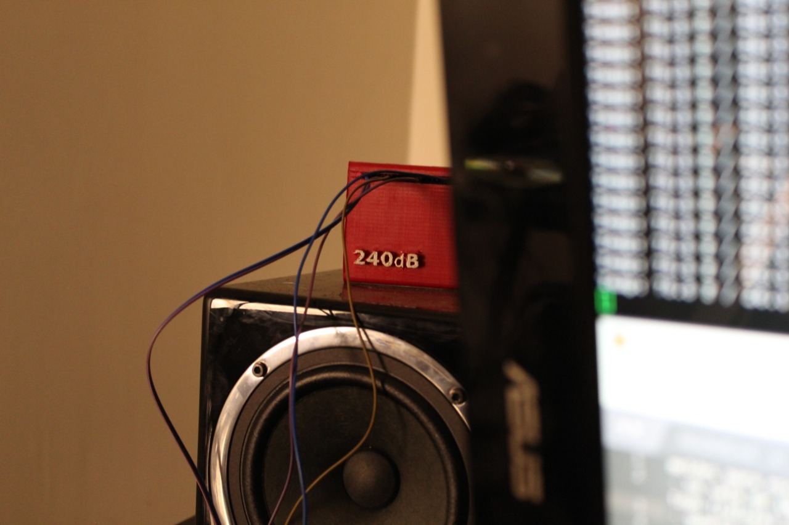

## 240dB Developer 

https://user-images.githubusercontent.com/28659434/204871790-593f3903-d4cb-4b5c-831b-cea3ccdf8f15.mp4

- 👋 Hi, I’m @240db
- 👀 I work as a data scientist in research/development sponsored by Institute Thompson Research (brief literature). 
- :musical_note: :musical_keyboard: :microphone: :musical_score: I make original music and technology

## Currently developing 💻

**Game Dev Pipeline** :video_game: 
- I develop  games, render graphics, supportive pipeline and technology for interactive audiovisual experience.

https://user-images.githubusercontent.com/28659434/204902574-803f6204-69b6-47cb-954e-9a5b85edd9c7.mp4

https://user-images.githubusercontent.com/28659434/204903750-414c9a7f-89cf-4cbf-a938-7f254be00266.mp4

https://user-images.githubusercontent.com/28659434/204904227-1638b8ba-c4f5-4732-944b-7f16ea26004e.mp4

**BI software** 📊💼

https://user-images.githubusercontent.com/28659434/204965737-eb8e091e-0411-4990-b14a-51f443c1c1bd.mp4

https://user-images.githubusercontent.com/28659434/204965744-79d76825-b439-466d-892e-e9e3cbcb2eaa.mp4

https://user-images.githubusercontent.com/28659434/204966130-3c86857a-8d8c-4aea-ad1b-c249bd8698e3.mp4

**Hardware** 🤖

Neuromarketing OpenBCI

3D printers

**FDM was easy but could one make a lcd_printer from smartphone repair consumables**

I certainly modified mine with 

- a reinforced duct exhaust vent system
- Resin automatic fill with pumps 

Arm low powered solutions in data acquisition and analytics, real time processing

## Kaggle Competitions currently involved 

| Competition Name | Deadline | Category | Award |
| ------------- | ------------- | ------------- | ------------- |

<!-- Past competitions -->
<!--| nfl-big-data-bowl-2023  | 2023-01-09 23:59:00 | Analytics | $100,000 |  -->
<!--| g2net-detecting-continuous-gravitational-waves | 2023-01-03 23:59:00 | Research | $25,000 |-->

## :trophy: Awards  

| Award Name | Date | 
| ------------- | ------------- |
| Max Matthews Award | March 2nd 2015 | 

### 🌱 I’m currently learning ...

- Openlane verilog skywater google 
- Agent Based Models 
- Actuarial science 
- Music, DSP, new machine learning, cgi tricks :) 

## 💞️ I’m looking to collaborate on ...

- Just about anything 

## 📫 How to reach me ...

Languages 
🇫🇷 French
🇬🇧 English
🇧🇷 Portuguese

Peek at 
https://reifier.cc/cvonline

<!---
240db/240db is a ✨ special ✨ repository because its `README.md` (this file) appears on your GitHub profile.
You can click the Preview link to take a look at your changes.
--->
